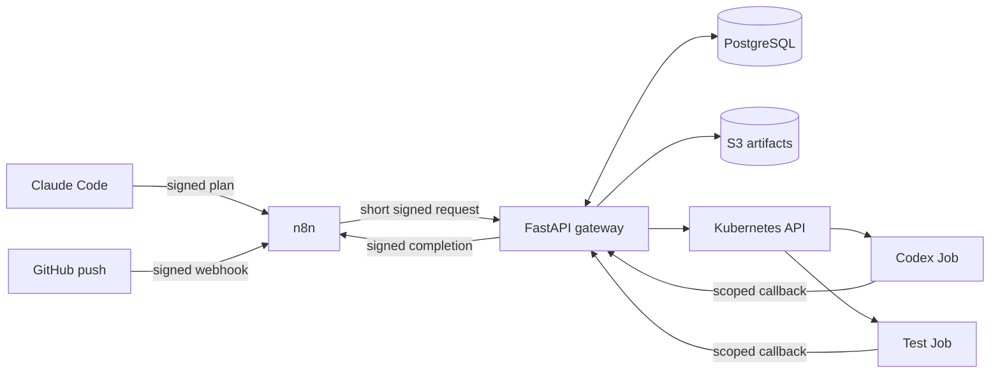

# Parallel AI Test Orchestrator Architecture (ADR-0001)

- Status: Accepted for the Milestone 1-3 POC
- Date: 2026-09-19
- Scope: discovery and architecture only; no runtime behavior changes

## Decision

Build a dedicated service instead of adding durable job behavior to the existing synchronous `ai-orchestrator /generate` endpoint. n8n remains at the edges for event intake and notification. A FastAPI gateway owns the state machine, authorization, idempotency, Kubernetes Jobs, and artifact metadata in PostgreSQL.

Codex generation and deterministic test execution run as separate Kubernetes Jobs. Only Codex Jobs receive model authentication. Test Jobs never receive model credentials, Git write credentials, production secrets, or Kubernetes API access.

Use S3-compatible object storage for immutable cluster artifacts and a filesystem adapter for local tests. Do not reuse the existing Codex PVC: it is ReadWriteOnce, contains sensitive login state, and belongs to a singleton Deployment.

## Target boundaries

| Component | Owns | Must not own |
| --- | --- | --- |
| n8n | webhook intake, routing, notification retry | durable state, clone, Codex, tests |
| Gateway | state, auth, idempotency, policy, Job launch, artifact metadata | target-code execution in API process |
| PostgreSQL | jobs, attempts, deliveries, events, optimistic versions | large artifact bodies |
| Object storage | plan, draft, JSONL, patch, logs, JUnit, coverage | authoritative job status |
| Codex Job | exact-SHA analysis and test-only patch | source push or production edits |
| Test Job | clean checkout, validated patch, fixed commands | model credentials or Kubernetes API |

Use `ai-test-system` for the gateway and state dependencies, and `ai-test-runners` for short-lived Jobs. Gateway RBAC is namespace-scoped and limited to runner Job lifecycle/status. Runner ServiceAccounts do not mount Kubernetes tokens. NetworkPolicy gives each component only role-specific ingress and egress; test Jobs cannot reach model endpoints.

## Identity and security

- `job_id` identifies the logical plan; `attempt_id` identifies one execution; `delivery_id` identifies one incoming or outgoing delivery.
- `base_sha` and `code_sha` are full 40-character Git SHAs. Branches are policy inputs, never checkout identities.
- HMAC-SHA256 signatures, timestamps, stored delivery IDs, and one-time callback tokens provide authentication, replay protection, and idempotency.
- Codex output is untrusted. The gateway rejects paths outside policy, traversal, symlinks, submodules, binary changes, file modes, deletes/renames, and oversized patches.
- API clients select command IDs only. The server maps them to fixed argv arrays with time, process, output, CPU, and memory limits.

Official OpenAI documentation supports `codex exec` automation, JSONL via `--json`, structured final output via `--output-schema`, and explicit sandbox selection. It also warns against job-level model keys when repository-controlled code is checked out or executed. Real runners will use `codex exec --ephemeral --json --output-schema ... -o ...`; the POC begins with fake Codex. See [OpenAI Docs: Non-interactive mode](https://learn.chatgpt.com/docs/non-interactive-mode).

The current ChatGPT-auth PVC will not be shared with concurrent Jobs until its ReadWriteOnce and session-isolation behavior is operationally reviewed. Model auth exists only in Codex Jobs; dependency installation and tests happen later in a clean credential-free Job.

## Persistence and deployment

PostgreSQL is the source of truth, with explicit transitions, append-only events, unique idempotency constraints, and optimistic locking. n8n execution history is not the job database.

S3-compatible storage is selected because concurrent Jobs need digest-addressed immutable artifacts and retention independent of nodes and RWO volumes. Required metadata includes SHA-256, byte length, media type, time, job/attempt IDs, and tested SHA.

Implementation follows the existing environment: Python 3.13 FastAPI with `pip` and `unittest`, Node 22 Bookworm for the pinned Codex runner, Jenkins/Kaniko builds, immutable build-number image tags, and an Argo CD-managed `parallel-ai-test-orchestrator/` path in `k8s-project-helm`.

The cluster-side controls that enforce these boundaries - namespaces, RBAC, NetworkPolicy, quotas, secret separation and the reconciler CronJob - are in [../k8s/](../k8s/README.md), and `gateway/tests/test_k8s_manifests.py` asserts them. Day-two procedures are in [operations.md](operations.md).

Discovery evidence, gaps, and proposed files are recorded in [discovery.md](discovery.md).
