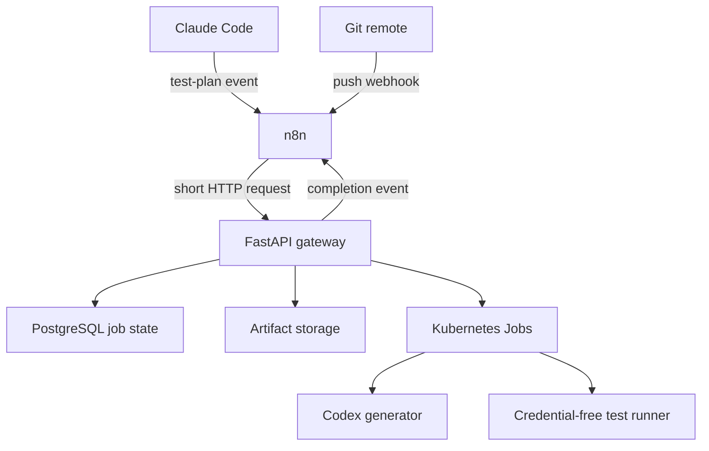
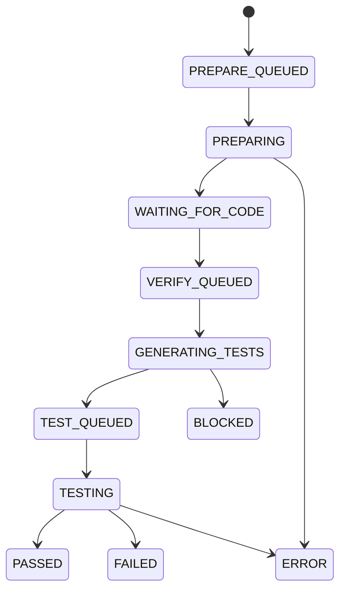

# Parallel AI Test Orchestrator — Implementation Plan

> แผนสำหรับสร้างระบบให้ Claude Code วางแผนและแก้ production code พร้อมกับให้ Codex เตรียม test design แบบขนาน จากนั้นเมื่อ Claude push commit แล้ว ระบบจะให้ Codex สร้าง automated tests สำหรับ commit นั้น และใช้ deterministic test runner รันเทสต์พร้อมรายงานผล

## 0. คำสั่งสำหรับ Codex

ให้ Codex ใช้เอกสารนี้เป็น implementation contract โดยปฏิบัติตามกติกาต่อไปนี้

1. เริ่มด้วยการสำรวจ repository, deployment manifests, FastAPI gateway, n8n และ Codex runner ที่มีอยู่ก่อน
2. ห้ามแทนที่ระบบเดิมทั้งก้อน ให้เพิ่มหรือปรับเฉพาะส่วนที่จำเป็น
3. ทำทีละ milestone และรัน verification ของ milestone นั้นก่อนทำขั้นต่อไป
4. ใช้ Git commit SHA เป็น immutable identifier สำหรับทุกการ prepare, generate และ test
5. n8n ทำหน้าที่รับ event และแจ้งผลเท่านั้น ส่วน job state และ business logic อยู่ใน FastAPI gateway
6. งานที่รัน repository code ต้องไม่มี OpenAI/Codex credential อยู่ใน environment
7. Codex แก้ได้เฉพาะ test files, fixtures และ report files ตาม allowlist ห้ามแก้ production code
8. ทุก webhook และ callback ต้องรองรับ idempotency, authentication และ replay protection
9. ถ้าโครงสร้าง repository จริงต่างจากเอกสารนี้ ให้บันทึก assumption และปรับ path โดยคง architecture และ security boundary เดิม
10. เมื่อจบแต่ละ milestone ให้รายงานไฟล์ที่เปลี่ยน คำสั่งที่รัน ผลเทสต์ และสิ่งที่ยังค้าง

## 1. เป้าหมาย

สร้าง pipeline ที่ทำงานตามลำดับนี้

1. ผู้ใช้ส่ง prompt ให้ Claude Code วางแผนและแก้ไขงาน
2. Claude Code สร้าง test plan แล้วส่งเข้า n8n/FastAPI โดยไม่ต้องรอผล
3. Codex เริ่มวิเคราะห์ repository และเตรียม test design ขณะที่ Claude Code กำลังแก้ production code
4. Claude Code commit และ push โค้ดไปยัง Git remote พร้อมระบุ `job_id`
5. Git push webhook แจ้ง n8n และ FastAPI ด้วย commit SHA
6. Codex checkout commit SHA นั้น สร้าง test patch ตาม plan และ test design
7. test runner ที่ไม่มี model credential ใช้ patch แล้วรัน unit/integration/e2e tests
8. ระบบเก็บ raw logs, JUnit, coverage, patch และ structured result
9. n8n นำผลไป comment ที่ Pull Request หรือส่ง notification

### เป้าหมายด้านคุณภาพ

- Claude Code และ Codex ทำงาน parallel ได้จริงหลังส่ง test plan
- ผลทดสอบทุกครั้งระบุ commit SHA ที่ถูกทดสอบอย่างชัดเจน
- webhook ซ้ำไม่สร้างงานซ้ำ
- commit ใหม่ทำให้ผลของ commit เก่าถูกระบุว่า `SUPERSEDED`
- production source branch ไม่ถูกแก้โดย Codex โดยตรง
- test result ตัดสินจาก process exit code/JUnit ไม่ใช่ข้อความสรุปของ AI
- ไม่มี production secret หรือ model credential ใน test execution job

## 2. สิ่งที่ไม่อยู่ใน MVP

- ให้ Codex merge Pull Request อัตโนมัติ
- ให้ Codex แก้ production code เพื่อทำให้ test ผ่าน
- รองรับหลาย Git provider พร้อมกันตั้งแต่รุ่นแรก
- dashboard แบบเต็มรูปแบบ
- autoscaling ที่ซับซ้อนหรือ distributed scheduler แยกต่างหาก
- ใช้ n8n เป็น durable job queue หรือ database หลัก

## 3. สมมติฐานเริ่มต้น

- n8n deploy อยู่บน Kubernetes และสามารถรับ inbound webhook ได้
- มี FastAPI gateway ที่เพิ่ม endpoint และติดต่อ Kubernetes API ได้
- มี Codex container/runner บน base image `node:22-bookworm`
- Git remote สามารถถูก clone จาก Kubernetes cluster ได้
- Claude Code สามารถเรียก script ใน repository หลังสร้าง test plan
- มี PostgreSQL สำหรับเก็บ job state หรือสามารถเพิ่ม schema ได้
- มี object storage เช่น MinIO/S3 หรือเริ่มด้วย PVC สำหรับเก็บ artifact ใน MVP
- repository เป้าหมายมีคำสั่งติดตั้งและรัน test ที่ระบุได้แน่นอน

## 4. Architecture ที่ต้องสร้าง



### ขอบเขตความรับผิดชอบ

| Component | หน้าที่ | ห้ามรับผิดชอบ |
| --- | --- | --- |
| Claude Code | วางแผนงาน, ส่ง test plan, แก้ production code, commit และ push | ตัดสินผลเทสต์ของตัวเอง |
| n8n | รับ webhook, validate ขั้นต้น, route event, แจ้งผล | ถือ job state หลัก, clone repo, รัน Codex, รัน test |
| FastAPI gateway | job state machine, idempotency, authorization, สร้าง K8s Job, จัดการ artifact | รัน repository code ใน process ของ gateway |
| Codex generator | วิเคราะห์และสร้าง test patch/report | push เข้า source branch, แก้ production code |
| Test runner | apply patch, install dependency, รัน test, สร้างผลเชิงโครงสร้าง | มี Codex/API key, เปลี่ยน source code |
| PostgreSQL | durable job/event state | เก็บ raw log ขนาดใหญ่ |
| Object storage | test plan, draft, patch, logs, JUnit, coverage | เป็น source of truth ของ job status |

## 5. Flow แบบ Parallel

### Phase A — Plan intake และ Codex prepare

1. Claude Code สร้าง `docs/test-plans/<task_id>.yaml`
2. Claude เรียก `scripts/submit-test-plan.sh`
3. script ส่ง plan, repository identifier, branch และ `base_sha` ไป n8n webhook
4. n8n ส่งต่อไป `POST /api/v1/test-jobs/prepare`
5. Gateway บันทึก job และตอบ `202 Accepted` ทันที
6. Gateway สร้าง `codex-prepare` Kubernetes Job
7. Codex checkout `base_sha` แล้วสร้าง `test-draft.json`
8. Job เปลี่ยนสถานะเป็น `WAITING_FOR_CODE`
9. ระหว่างข้อ 5–8 Claude Code แก้ production code ต่อโดยไม่ต้องรอ

สิ่งที่ prepare phase ต้องวิเคราะห์

- test framework และ convention ที่ repository ใช้อยู่
- test utilities, mocks, fixtures และ factories ที่ reuse ได้
- mapping ระหว่าง acceptance criteria กับ test level
- expected target files และ proposed test files
- edge cases, authorization, validation, transaction และ error paths
- dependency/service ที่ต้องจำลอง
- test commands ที่มีอยู่จริงใน `package.json` หรือ config ที่เกี่ยวข้อง

Prepare phase อาจสร้าง test skeleton ได้เฉพาะเมื่อ interface/contract ใน plan ระบุชัดเจน แต่ห้ามอ้างว่า compile หรือผ่านก่อนเห็น implementation commit

### Phase B — Claude implementation

Claude Code แก้ production code ตามแผน แล้ว commit ด้วย footer ต่อไปนี้

```text
feat(scope): implement requested behavior

AI-Test-Job: <job_id>
AI-Test-Phase: verify
```

จากนั้นต้อง push ไป Git remote เพราะ commit ที่ยังอยู่เฉพาะ local machine ไม่สามารถถูก checkout จาก Kubernetes ได้

### Phase C — Commit verification และ test generation

1. Git remote ส่ง push webhook ไป n8n
2. n8n หา `AI-Test-Job` จาก commit footer
3. n8n ส่ง `job_id`, `code_sha`, repository และ branch ไป Gateway
4. Gateway ตรวจว่า SHA มีอยู่จริงและอยู่บน branch ที่อนุญาต
5. Gateway เปลี่ยนสถานะเป็น `VERIFY_QUEUED`
6. Gateway สร้าง `codex-generate-tests` Job ที่ checkout exact `code_sha`
7. Codex โหลด original test plan และ test draft
8. Codex สร้างเฉพาะ test patch และ structured generation result
9. Gateway ตรวจ path ใน patch ว่าอยู่ใน allowlist
10. patch ถูกเก็บเป็น immutable artifact

### Phase D — Credential-free test execution

1. Gateway สร้าง test runner Job ใหม่โดยไม่มี Codex/OpenAI credential
2. Runner checkout exact `code_sha`
3. Runner apply test patch
4. Runner install dependency จาก lockfile
5. Runner รันคำสั่ง unit, integration และ e2e ตาม policy
6. Runner สร้าง raw log, JUnit XML, coverage และ `test-result.json`
7. Runner callback กลับ Gateway
8. Gateway ตัดสินสถานะจาก exit code และ parsed test result
9. Gateway ส่ง completion event ไป n8n
10. n8n comment ผลบน PR หรือส่ง notification

### Optional Phase E — Test repair loop

MVP+ สามารถให้ Codex แก้เฉพาะ test patch เมื่อ test compile ไม่ผ่านหรือ assertion ของ test เองผิด โดยมีข้อจำกัด

- ส่งเฉพาะ patch, relevant source และ sanitized logs ให้ Codex
- ห้ามแก้ production files
- รัน test ใน credential-free job ใหม่ทุกครั้ง
- จำกัดไม่เกิน 2 รอบ
- product behavior failure ต้องหยุดเป็น `FAILED` ไม่แก้ expectation ให้ผ่าน

## 6. Job State Machine



ทุก non-terminal state ต้องเปลี่ยนเป็น `TIMEOUT` ได้ และทุก job เก่าสามารถเปลี่ยนเป็น `SUPERSEDED` เมื่อมี commit ใหม่สำหรับ task เดียวกัน

### สถานะหลัก

| Status | ความหมาย |
| --- | --- |
| `PREPARE_QUEUED` | รับ plan แล้ว รอ Codex prepare |
| `PREPARING` | Codex วิเคราะห์ repository และ test plan |
| `WAITING_FOR_CODE` | test draft พร้อม รอ Claude push code |
| `VERIFY_QUEUED` | ได้ code SHA แล้ว รอสร้าง tests |
| `GENERATING_TESTS` | Codex กำลังสร้าง test patch |
| `TEST_QUEUED` | patch ผ่าน policy validation แล้ว |
| `TESTING` | credential-free runner กำลังรัน test |
| `PASSED` | required commands ทั้งหมด exit 0 และไม่มี required test ถูก skip |
| `FAILED` | assertion/build/test command ล้มเหลวจาก behavior ของ code |
| `BLOCKED` | plan ไม่พอ, contract ไม่ตรง หรือ patch ละเมิด policy |
| `ERROR` | infrastructure/agent/internal error |
| `TIMEOUT` | เกิน deadline |
| `SUPERSEDED` | มี commit ใหม่กว่าและผลนี้ไม่ใช่ผลล่าสุด |
| `CANCELLED` | ผู้ใช้หรือระบบยกเลิก |

## 7. Repository Layout ที่เสนอ

ให้ Codex map เข้ากับ repository เดิม ถ้าเป็น monorepo ให้ใช้โครงโดยประมาณนี้

```text
.
├── gateway/
│   ├── app/
│   │   ├── api/test_jobs.py
│   │   ├── domain/test_jobs.py
│   │   ├── services/job_service.py
│   │   ├── services/kubernetes_job_service.py
│   │   ├── services/artifact_service.py
│   │   ├── repositories/test_job_repository.py
│   │   └── security/webhook_auth.py
│   ├── migrations/
│   └── tests/
├── codex-runner/
│   ├── src/prepare.ts
│   ├── src/generate-tests.ts
│   ├── src/callback.ts
│   ├── prompts/
│   │   ├── prepare.md
│   │   └── generate-tests.md
│   ├── schemas/
│   │   ├── test-draft.schema.json
│   │   └── generation-result.schema.json
│   └── Dockerfile
├── test-runner/
│   ├── scripts/run-tests.sh
│   ├── scripts/validate-patch.sh
│   ├── schemas/test-result.schema.json
│   └── Dockerfile
├── contracts/
│   ├── test-plan.schema.json
│   ├── test-job.schema.json
│   └── events.schema.json
├── n8n/
│   ├── workflows/test-plan-received.json
│   ├── workflows/git-push-received.json
│   ├── workflows/test-job-completed.json
│   └── README.md
├── k8s/
│   ├── base/
│   │   ├── namespace.yaml
│   │   ├── service-account.yaml
│   │   ├── role.yaml
│   │   ├── role-binding.yaml
│   │   ├── network-policy.yaml
│   │   └── resource-quota.yaml
│   └── templates/
│       ├── codex-prepare-job.yaml
│       ├── codex-generate-job.yaml
│       └── test-runner-job.yaml
├── scripts/
│   └── submit-test-plan.sh
└── docs/
    ├── architecture.md
    ├── operations.md
    └── test-plans/example.yaml
```

## 8. Test Plan Contract

สร้าง JSON Schema และ sample YAML สำหรับรูปแบบนี้

```yaml
schema_version: "1.0"
task_id: "TASK-123"
repository: "project-slug"
branch: "feature/TASK-123"
base_sha: "<40-character-sha>"

scope:
  production_paths:
    - "src/modules/orders/**"
  allowed_test_paths:
    - "src/**/*.spec.ts"
    - "test/**"
    - "e2e/**"
  forbidden_paths:
    - ".github/**"
    - "k8s/**"
    - "package-lock.json"

acceptance_criteria:
  - id: "AC-001"
    description: "Create order when stock is sufficient"
  - id: "AC-002"
    description: "Reject order when stock is insufficient"

test_cases:
  - id: "TC-001"
    acceptance_criteria: ["AC-001"]
    level: "unit"
    target: "OrderService.create"
    given: "Product stock is 3"
    when: "User orders quantity 2"
    then:
      - "Order is persisted"
      - "Stock becomes 1"

commands:
  install: "npm ci"
  unit: "npm run test:unit"
  integration: "npm run test:integration"
  e2e: "npm run test:e2e"

policy:
  allow_network_during_tests: false
  max_test_minutes: 20
  allow_skipped_required_tests: false
  max_repair_attempts: 0
```

Gateway ต้อง reject plan เมื่อ

- `base_sha` ไม่ใช่ full SHA
- task ID หรือ path มี directory traversal
- command ไม่อยู่ใน command allowlist ของ repository
- `allowed_test_paths` ทับกับ protected production paths
- schema version ไม่รองรับ
- payload ใหญ่เกินกำหนด

## 9. FastAPI API Contract

### 9.1 Prepare job

```http
POST /api/v1/test-jobs/prepare
Authorization: Bearer <internal-token>
Idempotency-Key: <task-id>:<base-sha>:<plan-digest>
```

Request

```json
{
  "task_id": "TASK-123",
  "repository": "project-slug",
  "branch": "feature/TASK-123",
  "base_sha": "abc...",
  "plan": {},
  "callback_url": "https://n8n.example/webhook/test-job-completed"
}
```

Response `202`

```json
{
  "job_id": "atj_01...",
  "status": "PREPARE_QUEUED",
  "status_url": "/api/v1/test-jobs/atj_01..."
}
```

### 9.2 Submit implementation commit

```http
POST /api/v1/test-jobs/{job_id}/verify
```

```json
{
  "repository": "project-slug",
  "branch": "feature/TASK-123",
  "code_sha": "def...",
  "push_event_id": "provider-event-id"
}
```

ใช้ `job_id + code_sha` เป็น idempotency boundary

### 9.3 Read status

```http
GET /api/v1/test-jobs/{job_id}
```

ต้องคืน status, base SHA, latest code SHA, tested SHA, timestamps, artifact metadata, failure classification และ links ที่มีอายุจำกัด

### 9.4 Internal runner callback

```http
POST /internal/v1/test-jobs/{job_id}/events
```

```json
{
  "event_id": "evt_01...",
  "attempt": 1,
  "phase": "TEST",
  "status": "FAILED",
  "code_sha": "def...",
  "artifacts": [],
  "summary": {},
  "occurred_at": "2026-09-19T12:00:00Z"
}
```

callback ต้องใช้ service identity หรือ signed token แยกจาก public/internal n8n token

### 9.5 Cancel

```http
POST /api/v1/test-jobs/{job_id}/cancel
```

ต้องลบหรือหยุดเฉพาะ Kubernetes Job ของ `job_id` นั้น ห้ามใช้ label selector ที่กว้างโดยไม่ตรวจ target

## 10. Database Design

### `ai_test_jobs`

| Column | Type/หมายเหตุ |
| --- | --- |
| `id` | ULID/UUID primary key |
| `task_id` | external task identifier |
| `repository` | allowlisted repository slug |
| `branch` | source branch |
| `base_sha` | immutable prepare SHA |
| `code_sha` | latest implementation SHA |
| `tested_sha` | SHA ของผลล่าสุด |
| `plan_digest` | SHA-256 ของ canonical plan |
| `status` | state machine enum |
| `prepare_attempt` | integer |
| `verify_attempt` | integer |
| `latest_k8s_job_name` | nullable |
| `failure_class` | nullable enum |
| `failure_message` | sanitized text |
| `created_at/updated_at/completed_at` | timestamps |
| `version` | optimistic locking integer |

Unique constraints

- `(task_id, base_sha, plan_digest)` สำหรับ prepare idempotency
- `(id, code_sha)` สำหรับ verify attempt identity

### `ai_test_job_events`

- immutable append-only event table
- unique `event_id`
- เก็บ `job_id`, `phase`, `from_status`, `to_status`, `code_sha`, `payload`, `created_at`

### `ai_test_artifacts`

- `job_id`
- `attempt`
- `type`: `PLAN`, `DRAFT`, `PATCH`, `CODEX_JSONL`, `RAW_LOG`, `JUNIT`, `COVERAGE`, `RESULT`
- `object_key`
- `sha256`
- `size_bytes`
- `created_at`

## 11. n8n Workflows

### Workflow 1 — `test-plan-received`

Nodes

1. Webhook `POST /ai-test/plan`
2. ตรวจ authentication, payload size และ required fields
3. Normalize request
4. HTTP Request ไป FastAPI `/prepare`
5. Respond to Webhook ด้วย `202` และ `job_id`

ห้ามรอ Codex job จบใน execution เดียว

### Workflow 2 — `git-push-received`

Nodes

1. Git provider webhook
2. ตรวจ provider signature และ delivery ID
3. Filter เฉพาะ repository/branch ที่ allowlist
4. Extract `AI-Test-Job` และ `AI-Test-Phase: verify`
5. ส่ง `job_id`, full commit SHA และ delivery ID ไป `/verify`
6. ตอบ Git provider อย่างรวดเร็ว

ถ้า push มีหลาย commit ให้เลือก head commit ที่มี valid footer หรือ reject เป็น structured error ห้ามเดา job ID

### Workflow 3 — `test-job-completed`

Nodes

1. Authenticated internal webhook
2. Fetch authoritative result จาก FastAPI
3. IF `PASSED` / `FAILED` / `BLOCKED` / `ERROR`
4. สร้าง PR comment หรือ notification
5. ใส่ tested SHA, counts, duration และ report link ทุกครั้ง

## 12. Claude Code Integration

เพิ่มคำสั่งใน project instructions/Claude configuration ว่า

1. ก่อนแก้ production code ต้องสร้าง test plan ตาม schema
2. เรียก `submit-test-plan.sh` และรับ `job_id`
3. เก็บ `job_id` ในไฟล์ local ที่ไม่ commit เช่น `.ai-test/current-job`
4. ทำ implementation ต่อทันทีหลังได้ `202`
5. ก่อน commit ให้ตรวจว่า plan ถูก include ใน commit หรือ artifact ถูกบันทึกแล้ว
6. commit พร้อม required footer และ push

`submit-test-plan.sh` ต้อง

- ใช้ `git rev-parse --verify HEAD` เพื่อหา full base SHA
- validate plan locally ก่อนส่ง
- ส่ง authorization header จาก environment/secret store
- มี connection timeout และ retry เฉพาะ network/5xx
- ไม่ retry 4xx
- print เฉพาะ `job_id`, status และ error ที่ปลอดภัย
- ไม่ log token หรือ plan ที่อาจมี secret

## 13. Codex Runner Design

### MVP choice

ใช้ `codex exec` แบบ non-interactive ใน Kubernetes Job เพราะเหมาะกับ script/CI และให้ output แบบ JSONL ได้

ตัวอย่างแนวทาง invocation; ให้ตรวจ flag กับ Codex version ที่ติดตั้งจริงก่อนใช้งาน

```bash
codex exec \
  --sandbox workspace-write \
  --json \
  --output-schema /contracts/generation-result.schema.json \
  -o /artifacts/generation-result.json \
  - < /work/prompts/generate-tests.md
```

ข้อกำหนด

- stdout JSONL เก็บเป็น `CODEX_JSONL` artifact
- final structured output ต้องผ่าน JSON Schema
- บันทึก Codex thread/session ID ถ้าจะรองรับ resume ในอนาคต
- ใช้ `--sandbox workspace-write`; ไม่ใช้ `danger-full-access` ใน MVP
- post-process Git diff หลัง Codex จบ ไม่เชื่อเพียง prompt ว่าจะแก้เฉพาะ tests
- reject symlink, submodule change, lockfile change และ path นอก allowlist

### Prepare prompt requirements

- ห้ามแก้ repository
- ห้ามรัน dependency lifecycle scripts
- อ่าน test plan และ repository structure
- ส่งออก `test-draft.json` เท่านั้น
- ระบุ uncertainty และ contract ที่ยังไม่เห็นจาก base SHA

### Generate-tests prompt requirements

- checkout exact code SHA เรียบร้อยแล้วก่อนเริ่ม Codex
- เขียนเฉพาะ allowlisted test files
- map ทุก test ไปยัง test case ID/acceptance criteria
- ห้ามเปลี่ยน expectation เพื่อเลียนแบบ implementation ถ้าขัดกับ plan
- ห้ามแก้ production code, config, CI, manifests และ lockfiles
- ไม่ต้อง push Git branch
- ส่งออก summary แบบ structured

### App Server

App Server อาจใช้ในระยะหลังเมื่อต้องการ thread persistence/resume แต่ MVP ไม่ควร expose experimental WebSocket transport เป็น public Kubernetes Service ให้ใช้ local stdio/Unix socket ผ่าน adapter ภายใน runner เท่านั้น

## 14. Patch Validation

ก่อนส่ง patch ให้ test runner ต้องตรวจอย่างน้อย

- patch apply ได้บน exact `code_sha`
- changed paths อยู่ใน `allowed_test_paths`
- ไม่มี path อยู่ใน `forbidden_paths`
- ไม่มี `.gitmodules`, workflow, manifest, binary หรือ symlink change
- จำกัดจำนวนไฟล์และ patch size
- ไม่เพิ่ม skipped/disabled/focused test เช่น `.skip`, `xit`, `fdescribe`, `test.only` เว้นแต่ plan อนุญาตชัดเจน
- ไม่ลบ existing tests โดย default
- ไม่แก้ package scripts หรือ lockfile

ถ้า validation ไม่ผ่าน ให้จบเป็น `BLOCKED` พร้อม reason code ห้าม apply แบบบางส่วน

## 15. Test Runner Design

Test runner ต้องเป็น Kubernetes Job แยกจาก Codex generator และไม่มี model/API credential

ลำดับการทำงาน

1. สร้าง temporary workspace
2. clone/fetch repository ด้วย read-only deploy credential
3. checkout detached exact `code_sha`
4. verify `git rev-parse HEAD == code_sha`
5. apply validated patch
6. ตรวจ Git diff ซ้ำ
7. install dependency ตาม lockfile
8. start ephemeral dependencies เช่น PostgreSQL/Redis ตาม test profile
9. รัน commands ด้วย timeout แยกต่อ command
10. เก็บ exit code และ raw stdout/stderr
11. parse JUnit และ coverage
12. สร้าง `test-result.json`
13. upload artifacts
14. callback Gateway

### Failure classes

- `TEST_ASSERTION_FAILED`
- `TEST_COMPILE_FAILED`
- `BUILD_FAILED`
- `DEPENDENCY_INSTALL_FAILED`
- `ENVIRONMENT_FAILED`
- `PATCH_APPLY_FAILED`
- `COMMAND_TIMEOUT`
- `AGENT_FAILED`
- `POLICY_VIOLATION`
- `CALLBACK_FAILED`

## 16. Kubernetes Requirements

### Resources

- namespace แยก เช่น `ai-test-system`
- Gateway service account ที่สร้าง/get/list/watch/delete Job ได้เฉพาะ namespace นี้
- runner service account ไม่มีสิทธิ์สร้าง workload เพิ่ม
- `activeDeadlineSeconds`
- `ttlSecondsAfterFinished`
- CPU/memory requests และ limits
- `backoffLimit` ต่ำ เช่น 0 หรือ 1 ตาม phase
- `emptyDir` สำหรับ workspace
- read-only root filesystem ถ้า image รองรับ
- runAsNonRoot, drop Linux capabilities และ seccomp default

### Network policy

- prepare/generate job ติดต่อได้เฉพาะ Git remote, model endpoint, artifact storage และ Gateway callback
- test runner ติดต่อได้เฉพาะ package registry/cache, test dependencies, artifact storage และ Gateway callback ตามที่จำเป็น
- ถ้า `allow_network_during_tests: false` ให้แยกขั้น install dependency ออกจาก test execution หรือปิด egress ก่อนรัน test
- ห้าม test runner ติดต่อ metadata endpoint หรือ Kubernetes API

### Secrets

- Git read credential แยกจาก bot credential ที่สร้าง PR
- Codex/API credential mount เฉพาะ generator job
- callback token แยกต่อ workload type
- ห้าม inject model credential เป็น job-wide environment ที่ repository code สามารถอ่านได้
- ห้าม log Secret resource, environment dump หรือ auth file

## 17. Result Contract

`test-result.json`

```json
{
  "schema_version": "1.0",
  "job_id": "atj_01...",
  "task_id": "TASK-123",
  "base_sha": "abc...",
  "tested_sha": "def...",
  "patch_sha256": "...",
  "status": "FAILED",
  "started_at": "2026-09-19T12:00:00Z",
  "completed_at": "2026-09-19T12:04:00Z",
  "duration_seconds": 240,
  "summary": {
    "passed": 42,
    "failed": 2,
    "skipped": 0
  },
  "commands": [
    {
      "name": "unit",
      "command_id": "repo-test-unit",
      "exit_code": 0,
      "duration_seconds": 35
    }
  ],
  "coverage": {
    "lines": 82.1,
    "branches": 74.3
  },
  "failures": [],
  "artifacts": [],
  "uncovered_acceptance_criteria": []
}
```

เก็บ command ID ใน result และเก็บ actual command ใน server-side repository policy เพื่อไม่ให้ client ส่ง arbitrary shell command

## 18. Repository Policy

Gateway ต้องมี allowlisted configuration ต่อ repository เช่น

```yaml
repositories:
  project-slug:
    clone_url: "ssh://git.example/team/project.git"
    allowed_branches:
      - "feature/**"
      - "bugfix/**"
    test_commands:
      repo-install: ["npm", "ci"]
      repo-test-unit: ["npm", "run", "test:unit"]
      repo-test-integration: ["npm", "run", "test:integration"]
      repo-test-e2e: ["npm", "run", "test:e2e"]
    allowed_test_paths:
      - "src/**/*.spec.ts"
      - "test/**"
      - "e2e/**"
    forbidden_paths:
      - ".github/**"
      - "k8s/**"
      - "package*.json"
```

ห้าม execute shell string ที่มาจาก webhook/test plan โดยตรง ให้ map command ID เป็น argv array ที่ server ควบคุม

## 19. Observability

สร้าง structured logs และ metrics อย่างน้อย

- `job_id`, `task_id`, `repository`, `phase`, `attempt`, `base_sha`, `code_sha`
- phase duration
- queue latency
- K8s Job creation failures
- Codex execution success/failure
- patch validation failures
- test pass/fail/error/timeout counts
- webhook duplicate/rejected counts
- artifact upload/callback failures

ห้าม log

- authorization headers
- model/API keys
- Git credentials
- full environment variables
- source code หรือ test plan ทั้งก้อนโดย default

## 20. Implementation Milestones

### Milestone 0 — Discovery และ ADR

งาน

- สำรวจ FastAPI, n8n, Codex image, Git provider และ K8s manifests ที่มีอยู่
- ระบุ package manager, test framework และ authentication mechanism
- เขียน ADR สำหรับ architecture และ security boundary
- สรุป gap ระหว่างระบบจริงกับแผนนี้

Done เมื่อ

- มี `docs/architecture.md`
- มี decision ว่าจะเก็บ artifact ที่ไหน
- มี repository policy ตัวอย่างที่ใช้กับ repository จริง
- ไม่มีการเปลี่ยน runtime behavior

### Milestone 1 — Contracts และ persistence

งาน

- สร้าง JSON Schemas
- สร้าง database migrations
- สร้าง domain model และ state transition validator
- เพิ่ม idempotency และ event table

Verification

- schema validation tests
- valid/invalid state transition tests
- duplicate prepare/verify/event tests
- optimistic locking/concurrent update tests

### Milestone 2 — FastAPI prepare API

งาน

- implement `/prepare`, `GET status`, internal callback
- artifact abstraction
- fake Kubernetes job launcher สำหรับ tests
- auth, size limit, repository allowlist

Verification

- API unit/integration tests
- `202` response ภายในเวลาที่กำหนดโดยไม่รอ job
- duplicate idempotency key คืน job เดิม

### Milestone 3 — Codex prepare runner

งาน

- Node runner บน `node:22-bookworm`
- exact SHA checkout
- prompt assembly
- `codex exec --json` integration
- output schema validation
- upload draft/JSONL artifacts และ callback

Verification

- ใช้ fake Codex binary ใน automated tests
- invalid JSONL/final output handling
- timeout, signal และ callback retry tests

### Milestone 4 — Git webhook และ verify API

งาน

- n8n Git push workflow
- commit footer parser
- `/verify` endpoint
- supersede logic
- Kubernetes generate job creation

Verification

- duplicate push delivery ไม่สร้าง duplicate job
- invalid/missing footer ถูก reject ชัดเจน
- exact SHA ถูกส่งถึง runner
- newer SHA supersede older active attempt ได้

### Milestone 5 — Test generation และ patch policy

งาน

- generate-tests runner
- patch artifact generation
- path/policy validator
- generation result schema

Verification

- allowlisted test patch ผ่าน
- production/config/lockfile/symlink changes ถูก block
- partial patch ไม่ถูก apply
- patch digest deterministic

### Milestone 6 — Credential-free test runner

งาน

- test runner image
- patch apply และ exact SHA verification
- command allowlist executor
- JUnit/coverage parsing
- timeout/failure classification
- artifact upload และ callback

Verification

- runner environment ไม่มี Codex/API credential
- pass, test failure, build failure, install failure และ timeout scenarios
- raw exit code ตรงกับ structured result

### Milestone 7 — n8n completion และ notification

งาน

- plan intake workflow
- completion workflow
- PR comment/notification template
- retry และ dead-letter notification สำหรับ delivery failure

Verification

- workflow exports อยู่ใน source control
- result message มี tested SHA เสมอ
- notification retry ไม่สร้าง comment ซ้ำ

### Milestone 8 — K8s hardening และ end-to-end test

งาน

- ServiceAccount/RBAC
- NetworkPolicy
- resource limits/deadlines/TTL
- Secret separation
- cleanup/reconciliation process
- operations/runbook

Verification

- Gateway สร้าง job ได้เฉพาะ namespace เป้าหมาย
- runner ไม่สามารถเข้าถึง Kubernetes API
- test runner ไม่มี model credential
- end-to-end happy path และ failed-test path ผ่านใน staging

## 21. Automated Test Strategy สำหรับระบบนี้

### Unit tests

- plan/schema validation
- commit footer parser
- state transition guard
- idempotency key handling
- repository policy/path matcher
- patch validator
- failure classifier
- result/JUnit parser
- notification renderer

### Integration tests

- FastAPI + test PostgreSQL
- fake object storage
- fake Kubernetes API/job launcher
- fake Git remote
- fake Codex executable ที่ปล่อย JSONL หลายรูปแบบ
- signed webhook verification
- duplicate/out-of-order callbacks

### End-to-end tests

1. ส่ง plan → prepare job complete → `WAITING_FOR_CODE`
2. push commit → generate patch → test pass → notification `PASSED`
3. push commit → test assertion fail → notification `FAILED`
4. push SHA ใหม่ระหว่าง SHA เก่ากำลัง test → ผลเก่า `SUPERSEDED`
5. Codex พยายามแก้ production file → `BLOCKED`
6. webhook/callback ซ้ำ → ไม่มี duplicate execution/comment
7. runner timeout → `TIMEOUT` พร้อม partial logs

## 22. MVP Acceptance Criteria

- [ ] Claude ส่ง test plan แล้วได้รับ `job_id` ภายใน 5 วินาทีในสภาพปกติ
- [ ] Codex prepare เริ่มทำงานโดย Claude ไม่ต้องรอ
- [ ] local commit ที่ยังไม่ push ไม่ trigger verification
- [ ] pushed commit ที่มี valid footer trigger exact SHA verification
- [ ] Codex สร้าง test patch โดยแก้ได้เฉพาะ allowlisted paths
- [ ] test execution ทำงานใน job ที่ไม่มี model credential
- [ ] PASS/FAIL มาจาก exit code และ parsed result
- [ ] result มี `tested_sha`, commands, counts, duration และ artifact references
- [ ] duplicate webhook/callback ไม่สร้างงานหรือ notification ซ้ำ
- [ ] commit ใหม่ supersede ผลเก่าได้
- [ ] raw logs, JUnit, coverage และ patch ถูกเก็บและตรวจ checksum ได้
- [ ] n8n workflow exports และ K8s manifests อยู่ใน source control
- [ ] มี runbook สำหรับ retry, cancel, timeout, cleanup และ secret rotation

## 23. Rollout Plan

### Stage 1 — Local/staging with fake Codex

- ใช้ fake Codex output เพื่อทำ state machine, webhook และ runner ให้ครบก่อน
- ใช้ repository ตัวอย่างที่ไม่มี secret

### Stage 2 — Real Codex, unit tests only

- เปิดเฉพาะ unit test command
- ให้มนุษย์ตรวจ patch ก่อน test runner apply
- ไม่ push test branch อัตโนมัติ

### Stage 3 — Integration tests

- เพิ่ม ephemeral PostgreSQL/Redis
- เพิ่ม artifact retention และ timeout monitoring

### Stage 4 — PR integration

- สร้าง test-only branch/PR ด้วย bot identity แยก
- protected branch และ required human review

### Stage 5 — Optional repair loop

- เปิดไม่เกิน 1–2 รอบ
- แยก product failure ออกจาก malformed test ชัดเจน

## 24. Risks และวิธีลดความเสี่ยง

| Risk | Mitigation |
| --- | --- |
| Codex เขียน test ตาม implementation จนไม่ตรวจ requirement | map test ทุกตัวกับ AC/TC ID และคง test plan เป็น authority |
| Codex แก้ production code | path allowlist + Git diff validator + test-only patch |
| API key ถูก test code อ่าน | แยก Codex generator กับ credential-free test runner |
| push หลายครั้งทำให้ผลสลับกัน | bind result กับ SHA และ supersede logic |
| webhook ส่งซ้ำ/out of order | delivery ID, idempotency table, state transition guard |
| n8n execution ค้างนาน | ตอบ 202 แล้วใช้ callback workflow แยก |
| arbitrary command injection | repository command ID → server-side argv mapping |
| prompt injection จาก source code | strict runner policy, isolated container, patch validation, no direct push |
| test flakiness | retry เฉพาะ test ที่ระบุ flaky policy และรายงาน attempt ทุกครั้ง |
| artifact ถูกแก้ย้อนหลัง | content hash และ immutable object key |

## 25. Definition of Done

โปรเจกต์ถือว่าเสร็จเมื่อ

1. flow ตั้งแต่ Claude ส่ง plan จนถึง notification ทำงานแบบ end-to-end บน staging
2. Claude และ Codex ทำงาน parallel หลัง `/prepare` ตอบ `202`
3. exact code SHA ถูกใช้ทุกจุดและแสดงในผลลัพธ์
4. test runner ไม่มี model credential และผ่าน security check
5. Codex ไม่สามารถแก้ไฟล์นอก test allowlist ได้
6. automated tests ครอบคลุม state machine, idempotency, patch policy และ failure paths
7. มี n8n exports, K8s manifests, migrations, schemas, prompts และ runbook ครบ
8. ผู้ดูแลสามารถ retry, cancel, inspect logs และ cleanup job ได้โดยไม่แก้ข้อมูลใน database ด้วยมือ

## 26. ลำดับเริ่มทำที่แนะนำ

ให้ Codex เริ่มจาก Milestone 0 แล้วหยุดรายงาน discovery และ proposed file changes ก่อน จากนั้นทำ Milestone 1–3 เป็น POC แรก เป้าหมาย POC คือ

- Claude ส่ง sample plan
- Gateway สร้าง job และตอบ 202
- fake/real Codex prepare สร้าง valid `test-draft.json`
- Gateway เปลี่ยน job เป็น `WAITING_FOR_CODE`
- สามารถ query status และดู artifact ได้

เมื่อ POC นี้ผ่าน ค่อยต่อ Git push, test generation และ credential-free test execution เพื่อหลีกเลี่ยงการ debug ทุก component พร้อมกัน

## 27. แหล่งอ้างอิงสำหรับส่วน Codex

- OpenAI Docs — Non-interactive mode: https://learn.chatgpt.com/docs/non-interactive-mode
- OpenAI Docs — Codex App Server: https://learn.chatgpt.com/docs/app-server

ประเด็นที่ implementation ต้องยึดตามเอกสารปัจจุบัน

- `codex exec` ใช้สำหรับ scripts/CI และรองรับ JSONL output
- ใช้ explicit sandbox เช่น `workspace-write`
- ใช้ output schema สำหรับ machine-readable result
- API credential ต้องไม่อยู่ใน environment เดียวกับ untrusted repository code ที่ถูก execute
- App Server WebSocket transport ยังเป็น experimental จึงไม่ใช้เป็น public production transport ใน MVP
